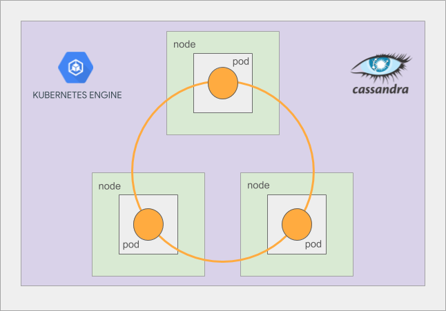

# Google Kubernetes Engine Stateful Application Demo

## Table of Contents

<!--ts-->
* [Google Kubernetes Engine Stateful Application Demo](#google-kubernetes-engine-stateful-application-demo)
* [Introduction](#introduction)
* [Architecture](#architecture)
   * [Architecture Diagram](#architecture-diagram)
   * [Kubernetes Manifests and Controllers](#kubernetes-manifests-and-controllers)
      * [StatefulSets](#statefulsets)
      * [Persistent Storage with Persistent Volumes](#persistent-storage-with-persistent-volumes)
      * [Pod Disruptions Budgets](#pod-disruptions-budgets)
      * [Pod Scheduling](#pod-scheduling)
      * [DNS and Headless Services](#dns-and-headless-services)
   * [Cassandra Container](#cassandra-container)
* [Deployment Steps](#deployment-steps)
* [Validation](#validation)
   * [Using Cassandara](#using-cassandara)
   * [Launch a Cassandra container](#launch-a-cassandra-container)
   * [Connect to the ring with cqlsh](#connect-to-the-ring-with-cqlsh)
      * [cqlsh command](#cqlsh-command)
   * [Create a keyspace](#create-a-keyspace)
   * [Describe the keyspace](#describe-the-keyspace)
   * [Use the new keyspace](#use-the-new-keyspace)
   * [Create a table](#create-a-table)
   * [See the newly created table](#see-the-newly-created-table)
   * [Insert data into the table](#insert-data-into-the-table)
   * [Select the data from the table](#select-the-data-from-the-table)
   * [Exit](#exit)
      * [Delete the deployment](#delete-the-deployment)
* [Tear Down](#tear-down)
* [Troubleshooting](#troubleshooting)
* [Relevant Materials](#relevant-materials)
<!--te-->

## Introduction

This proof of concept deploys a
[Kubernetes Engine](https://cloud.google.com/kubernetes-engine/)
Cluster and then installs an [Apache Cassandra](http://cassandra.apache.org/)
database running on that cluster.

Various scripts are contained within this project that provide push button
creation, validation, and deletion of the Cassandra(C*) database and Kubernetes
Engine cluster.

Apache Cassandra was chosen for various reasons.  These reasons include that
out of the box Cassandra functions well as a cloud native database.  Moreover,
this POC continues the work started with the Kubernetes example, and the blog
post: [Thousand Instances of Cassandra using Kubernetes Pet Set][1].

When running a database using Kubernetes Engine, as an operator you need to be experienced with Kubernetes Engine
and the datasource that you are running.  If you are able to use a hosted
solution then it is recommended that you use the hosted solution. On the other
hand, if you are not able to run a datasource in a hosted solution then hosting
it is Kubernetes Engine is doable.  The challenge is not Kubernetes or Kubernetes Engine, but the challenge
is migrating and operating a database in a container based system that can do
things like moving pods/containers between nodes.

## Architecture

The intricacy of the running stateful datastores via Kubernetes Engine or K8s lies with
the various Kubernetes manifests and pod configurations used. A container that
has been customized to run as a pod is used as well. This demo includes multiple
configured manifests and a specialized container for Cassandra.

Many people, including Kelsey Hightower, have talked about how running stateful
datestores inside of K8s is not trivial, and frankly quite complicated.  If you
can run a database on a managed service, do it.  Let someone else wake up at 2
am to fix your database.

There are two possibilities when you run a stateful datastore on K8s.

1. You are very experienced K8s user and know exactly what is around the corner.
1. You have no idea what is around the corner, and you are going to learn very
  fast.

### Architecture Diagram

The following diagram represents a Cassandra cluster deployed on Kubernetes Engine.



### Kubernetes Manifests and Controllers

Various manifests and controllers are utilized to install Cassandra.  The
following sections outline the different types used.

#### StatefulSets

StatefulSets is the controller type that is used to install a Cassandra Ring on
Kubernetes Engine.  This controller manages the installation and scaling of a set of Pods and
provides various features:

1. Stable, unique network identifiers.
1. Stable, persistent storage.
1. Ordered, graceful deployment and scaling.
1. Ordered, graceful deletion and termination.
1. Ordered, automated rolling updates.
1. Automated creation of storage volumes.
1. Stable guaranteed storage.

Like a Deployment, a StatefulSet manages Pods that are based on an identical
container spec. Unlike a Deployment, a StatefulSet maintains a sticky identity
for each of their Pods. These pods are created from the same spec, but are not
interchangeable: each has a persistent identifier that it maintains across any
rescheduling.

Cassandra utilizes all of these features in order to run on Kubernetes Engine.

Find more information [here][2].

#### Persistent Storage with Persistent Volumes

With a stateful datasource storage is required.

A PersistentVolume (PV) is a piece of storage in the cluster that has been
provisioned by an administrator, or automatically by a Stateful Set. It is a
resource in the cluster just like a node is a cluster resource. PVs are volume
plugins like Volumes, but have a lifecycle independent of any individual pod
that uses the PV.

A PersistentVolumeClaim (PVC) is a request for storage by a user. It is similar
to a pod. Pods consume node resources and PVCs consume PV resources. Pods can
request specific levels of resources (CPU and Memory). Claims can request
specific size and access modes (e.g., can be mounted once read/write or many
times read-only).

Find more information [here][3].

#### Pod Disruptions Budgets

An Application Owner can create a PodDisruptionBudget object (PDB) for each
application. A PDB limits the number pods of a replicated application that are
down simultaneously from voluntary disruptions. For example, with Cassandra
we need to ensure that the number of replicas running is never brought below
the number needed for a quorum.

Find more information visit [here][4].

#### Pod Scheduling

This proof of concept utilizes advanced scheduling for pod placement.  Both
scheduling anti-affinity rules and taints are used to instruct the K8s scheduler
where to launch C* pods.

Anti-Affinity rules instruct the scheduler to use preferred or required pod
placement. Preferred rules provide a weight value that impacts the scheduling
algorithm to not schedule C* pods on the same node.  While required rules force
the scheduler to not schedule C* pods on the same node.  Not having multiple
Cassandra pods on the same node increases fault tolerance, as when you lose a
node you only lose one pod.  But then you need to have an excess of nodes because
a pod will not reschedule.  Preferred does not provide the same level of high
availability, but will allow pods to reschedule on existing nodes if headroom
exists.

Find more information visit [here][5].

Taints prevent pods to be scheduled on a node, unless the pod's manifest
contains the required toleration. The typical use case for this is to target
a specific node pool for say Cassandra pods.  For instance, often larger machine
types are required for C*, and adding taints to those nodes ensure that
Cassandra pods will only be scheduled on the nodes.

Find more information visit [here][6].

#### DNS and Headless Services

The Cassandra ring that is installed as part of this demo is named "cassandra".
The name of the service "cassandra" creates the DNS name, and the tld is
"default.svc.cluster.local", where "default" is the name of the namespace.  With
an application you would connect to at least three of the nodes to provide an HA
connection with a client.  The name of the nodes, for example would be:

```
cassandra-0.cassandra.default.svc.cluster.local
cassandra-1.cassandra.default.svc.cluster.local
cassandra-1.cassandra.default.svc.cluster.local
```

For more information visit [here][7].

### Cassandra Container

Within this demo we have included a container that is specifically built for
running on Kubernetes.  Features:

1. OSS maintained base container that is used by K8s OSS project
1. Cassandra is installed from a tarball
1. Container size has been reduced
1. A readiness and liveness probes are built-in
1. Prometheus is installed, but the port is not exposed in the manifest by
  default
1. dumb-init is used to handle signal processing
1. A logging encoder is provided for JSON logging
1. Datacenter configuration
1. JMX configuration
1. Multiple ENV variables are exposed for manifest based configuration

For more information about the ENV variables that have been exposed see
[container/README.md](contain/README.md),
[container/files/run.sh](container/files/run.sh) and also the
[manifest](manifests/cassandra-statefulset.yaml).

This container is hosted by Google Professional Services.

## Deployment Steps

To deploy the demo execute the following commands.

```console
git clone https://github.com/GoogleCloudPlatform/gke-stateful-applications-demo
cd gke-stateful-applications-demo
./create.sh -c my-cluster-1
```

Replace the text 'my-cluster-1' the name of the cluster that you would like to
create.

The create script will output the following message when complete.

```console
NAME                 MACHINE_TYPE   DISK_SIZE_GB  NODE_VERSION
nodepool-cassdemo-2  n1-standard-1  100           1.10.2-gke.3
```

The script will:

1. create a new Kubernetes Engine cluster in your default ZONE, VPC and network.
1. install multiple Kubernetes manifests that can be found in the
[manifests](./manifests) directory.

Because we are creating a cluster of 6 nodes, the cluster may go into a
'RECONCILING' status as the control plane's instance size may be increased.

Use the following command to view the current status of the cluster.

```console
gcloud container clusters list
```

An example of the output while the cluster is reconciling.

```console
NAME          LOCATION       MASTER_VERSION  MASTER_IP      MACHINE_TYPE   NODE_VERSION  NUM_NODES  STATUS
my-cluster-1  us-central1-a  1.10.2-gke.3    35.184.70.165  n1-standard-4  1.10.2-gke.3  6          RECONCILING
```

The status will change to RUNNING once the masters have been updated.

## Validation

The following script will validate that the demo is deployed correctly:

```console
./validate.sh -c my-cluster-1
```
Replace the text 'my-cluster-1' the name of the cluster that you would like to
validate.

The validation script uses `kubectl rollout status` to test if the rollout is
complete. If the cluster is in 'RECONCILING' state this script will fail as
well.

If the script fails it will output:

```console
Validation Failed: Statefulset has not been deployed
```

If the script passes if will output:

```console
Validation Passed: the Statefulset has been deployed
```

### Using Cassandara

These commands exercise the Cassandra cluster.

### Launch a Cassandra container

These `kubectl` commands launch a K8s deployment, wait for the deployment,
and exec into the shell.

```console
kubectl run cass-dev --image gcr.io/pso-examples/cassandra:3.11.4-cqlsh-v22 --command -- /bin/bash -c "tail -f /dev/null"
kubectl rollout status deployment cass-dev
kubectl exec $(kubectl get po --no-headers | grep cass-dev | awk '{print $1}') -it -- /bin/bash
```

This will launch a bash prompt for the next steps.

### Connect to the ring with cqlsh

#### cqlsh command

```console
/usr/local/apache-cassandra/bin/cqlsh cassandra-0.cassandra.default.svc.cluster.local
```

You will now be using the interactive `cqlsh` shell.

The output of the command:

```console
Connected to K8Demo at cassandra-0.cassandra.default.svc.cluster.local:9042.
[cqlsh 5.0.1 | Cassandra 3.11.4 | CQL spec 3.4.4 | Native protocol v4]
Use HELP for help.
cqlsh>
```

### Create a keyspace

```console
CREATE KEYSPACE greek_monsters WITH REPLICATION = { 'class' : 'SimpleStrategy' , 'replication_factor' : 3 };
```

The user prompt is shown if the command is successful.

### Describe the keyspace

```console
DESC greek_monsters;
```

Example output:

```console
CREATE KEYSPACE greek_monsters WITH replication = {'class': 'SimpleStrategy', 'replication_factor': '3'}  AND durable_writes = true;

cqlsh>
```

### Use the new keyspace

```console
USE greek_monsters;
```

The prompt will now include the keyspace that is selected.

```console
cqlsh:greek_monsters>
```

### Create a table

```console
CREATE TABLE monsters (pet_id timeuuid, name text, description text, PRIMARY KEY (pet_id));
```
The user prompt is shown if the command is successful.

### See the newly created table

```console
DESCRIBE TABLES;
```

This command will output:

```console
monsters

cqlsh:greek_monsters>
```

### Insert data into the table

```console
INSERT INTO monsters (pet_id,name,description) VALUES (now(), 'Cerberus (Hellhound)','The three-headed giant hound, that guarded the gates of the Underworld.');
INSERT INTO monsters (pet_id,name,description) VALUES (now(), 'Orthrus','A two-headed dog, brother of Cerberus, slain by Heracles.');
INSERT INTO monsters (pet_id,name,description) VALUES (now(), 'Argos','Odysseus faithful dog, known for his speed, strength and his superior tracking skills.');
INSERT INTO monsters (pet_id,name,description) VALUES (now(), 'Golden Dog','A dog which guarded the infant god Zeus.');
INSERT INTO monsters (pet_id,name,description) VALUES (now(), 'Guard Dog of Hephaestus Temple','The temple of Hephaestus at Mount Etna was guarded by a pack of sacred dogs.');
INSERT INTO monsters (pet_id,name,description) VALUES (now(), 'Laelaps',' female dog destined always to catch its prey.');
INSERT INTO monsters (pet_id,name,description) VALUES (now(), 'Maera','The hound of Erigone, daughter of Icarius of Athens.');
```

The user prompt is shown if the command is successful.

### Select the data from the table

```console
SELECT * from monsters ;
```

Example output:

```console
pet_id                               | description                                                                            | name
--------------------------------------+----------------------------------------------------------------------------------------+--------------------------------
ca3d9f20-6a89-11e8-a0dd-114bb9e30b07 | Odysseus faithful dog, known for his speed, strength and his superior tracking skills. |                          Argos
ca3c3f90-6a89-11e8-a0dd-114bb9e30b07 |                              A two-headed dog, brother of Cerberus, slain by Heracles. |                        Orthrus
ca42f650-6a89-11e8-a0dd-114bb9e30b07 |                                   The hound of Erigone, daughter of Icarius of Athens. |                          Maera
ca3f4cd0-6a89-11e8-a0dd-114bb9e30b07 |                                               A dog which guarded the infant god Zeus. |                     Golden Dog
ca41bdd0-6a89-11e8-a0dd-114bb9e30b07 |                                          female dog destined always to catch its prey. |                        Laelaps
ca40ac60-6a89-11e8-a0dd-114bb9e30b07 |           The temple of Hephaestus at Mount Etna was guarded by a pack of sacred dogs. | Guard Dog of Hephaestus Temple
ca3a6ad0-6a89-11e8-a0dd-114bb9e30b07 |                The three-headed giant hound, that guarded the gates of the Underworld. |           Cerberus (Hellhound)
```

### Exit

Exit the pod with the following commands:

```console
exit
exit
```

This will return you to your command line.

#### Delete the deployment

Execute the following command to remove the deployment.

```console
kubectl delete deployment cass-dev
```

The following message is displayed:

```console
deployment "cass-dev" deleted
```

## Tear Down

The following script will tear down the Cassandra cluster and remove the Kubernetes Engine
cluster.

```console
./delete.sh -c my-cluster-1
```

This output will change depending on the cluster name.  In this example the name
"my-cluster-1" was used.

Replace the text 'my-cluster-1' the name of the cluster that you would like to
validate.  The last lines of the output will be:

```console
persistentvolumeclaim "cassandra-data-cassandra-0" deleted
persistentvolumeclaim "cassandra-data-cassandra-1" deleted
persistentvolumeclaim "cassandra-data-cassandra-2" deleted
Deleting cluster
```

The tear down script removes all of the components in the manifests directory,
and it also destroys the cluster.  This script also waits 60 seconds before
it removes the PVC storage components.

## Troubleshooting

1. Since we are creating two nodepools in this demo, the cluster may upgrade
 the control plane and it may go to a "RECONCILING" state.  Give the cluster
 some time and it will scale.  The validate script will fail during this time.
2. Run "gcloud container clusters list" command to check the cluster status.
  Cluster
3. If you get errors about quotas, please increase your quota in the project.
 See [here][8] for more details.
4. A great diagnostic command to run is simply `kubectl get pods`.  It will show
 the running pods.

Initially, the cluster may show as "RUNNING" but then go into a "RECONCILING" state
The symptom will be timeouts when running `kubectl get pods`
Use the "gcloud container clusters list" command to check the latest state, and wait until it changes back to "RUNNING"


## Relevant Materials

1. [Thousand Instances of Cassandra][1]
2. [Stateful Sets][2]
3. [Persistent Volumes][3]
4. [Pod Disruption Budgets][4]
5. [Pod Scheduling][5]
6. [Taints and Tolerations][6]
7. [Headless Services][7]
8. [Google Cloud Quotas][8]
9. [Signup for Google Cloud][9]
10. [Google Cloud Shell][10]

[1]: https://kubernetes.io/blog/2016/07/thousand-instances-of-cassandra-using-kubernetes-pet-set
[2]: https://kubernetes.io/docs/tutorials/stateful-application/basic-stateful-set/
[3]: https://kubernetes.io/docs/concepts/storage/persistent-volumes/
[4]: https://kubernetes.io/docs/concepts/workloads/pods/disruptions/
[5]: https://kubernetes.io/docs/concepts/configuration/assign-pod-node/#inter-pod-affinity-and-anti-affinity-beta-feature
[6]: https://kubernetes.io/docs/concepts/configuration/taint-and-toleration/
[7]: https://kubernetes.io/docs/concepts/services-networking/service/#headless-services
[8]: https://cloud.google.com/compute/quotas
[9]: https://cloud.google.com
[10]: https://cloud.google.com/shell/docs/

**This is not an officially supported Google product**
